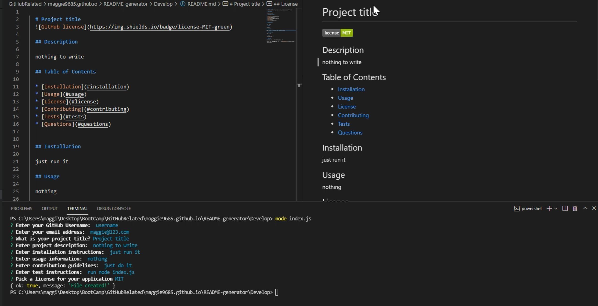

# README-generator

This app is to help shorten the time we need to write a README.md file. After user answers some simple questions, a README file will be created and if user select a license for the project, a badge will display on the top of the README. A sample README file is inside the Develop folder of this repository.

#### Questions and the generated README file as follow

## Built With
* Javascript

## License
Licensed under the MIT license.

